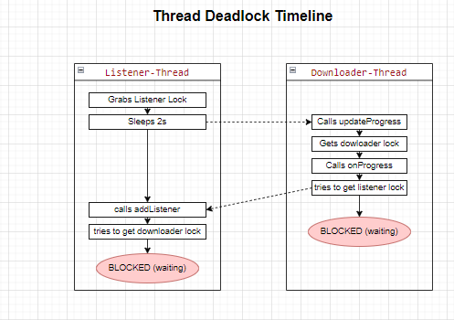

# Problem 1

_What is the double-checked locking anti-pattern? Why is it an anti-pattern?_

Doppelt überprüftes Sperren (englisch: Double-Checked Locking) ist ein Anti-Pattern, das oft bei der Erstellung von Singleton-Objekten in Mehrthread-Programmen verwendet wurde.

### Was ist doppelt überprüftes Sperren?

Stellen Sie sich vor, Sie benötigen ein sogenanntes "Singleton"-Objekt, also ein Objekt, von dem es in Ihrem Programm nur genau eine Instanz geben darf. In einem Mehrthread-Programm ist es essenziell, dass mehrere Threads auf dasselbe Objekt zugreifen können, ohne es aus Versehen zweimal zu erzeugen.
Die Idee beim doppelt überprüften Sperren ist:

- Zuerst wird geschaut, ob das Objekt schon existiert (Überprüfung Nr. 1).
- Falls es noch nicht existiert, wird ein Lock (eine Sperre) gesetzt, damit nur noch ein Thread gleichzeitig das Objekt erzeugen darf.
- Innerhalb der Sperre wird nochmal geprüft, ob das Objekt inzwischen von einem anderen Thread erzeugt wurde (Überprüfung Nr. 2).
- Wenn es wirklich noch nicht existiert, wird es erzeugt.

In Pseudocode sähe das so aus:

```java
if (objekt == null) {               // Überprüfung Nr. 1
    synchronized (Lock) {           // Lock, um Zugriff zu schützen
        if (objekt == null) {       // Überprüfung Nr. 2
            objekt = new Objekt();  // Erzeugung des Singletons
        }
    }
}
return objekt;
```

### Warum ist das ein Anti-Pattern?

1. Unsicher in der Praxis:  
   In manchen Programmiersprachen (z.B. ältere Java-Versionen) und durch bestimmte Optimierungen im Prozessor und Compiler kann es passieren, dass ein anderer Thread das Singleton-Objekt schon als „fertig erzeugt“ sieht, obwohl es noch gar nicht vollständig initialisiert wurde. Das führt zu schwer auffindbaren Fehlern.

2. Komplexität:
   Das Hinzufügen von zwei Überprüfungen plus Locking macht den Code kompliziert und schwer verständlich. Oft ist es leichter und sicherer, eine einfachere Lösung zu wählen.

3. Bessere Alternativen:  
   Es gibt oft bessere (und einfachere) Wege, ein Singleton zu erstellen, zum Beispiel:
   - Eager Initialization (das Objekt wird schon beim Programmstart erzeugt),
   - oder eine statische Klassenvariable, die thread-sicher verwaltet wird (z.B. mit „synchronized“ beim Zugriff oder mithilfe spezieller Sprachkonstrukte wie dem „static Holder“ in Java).

### Ein einfaches Beispiel, wie es anders geht

Anstatt die doppelt überprüfte Sperre zu verwenden, besteht in Java die Möglichkeit, beim Laden der Klasse einfach eine private statische Instanz anzulegen.

```java
public class Singleton {
    private static final Singleton INSTANCE = new Singleton();

    private Singleton() {
        // privater Konstruktor
    }

    public static Singleton getInstance() {
        return INSTANCE;
    }
}
```

Hier wird das Singleton-Objekt „INSTANCE“ sofort angelegt, sobald die Klasse geladen wird. Das ist sehr einfach und thread-sicher.

## FAZIT

- Doppelt überprüftes Sperren sieht auf den ersten Blick wie eine clevere Optimierung für Singletons in Mehrthread-Programmen aus.
- In der Realität führt es aber oft zu kompliziertem Code und Fehlern in der Speicherverwaltung, weil Threads das Objekt möglicherweise zu früh oder unvollständig sehen.
- Deshalb gilt es als Anti-Pattern, und man sollte bevorzugt einfachere und sicherere Lösungen verwenden.

# Problem 2

_Complement the Downloader class from the lecture with a ProgressListener implementation and a main method that lead to a deadlock. Draw a sketch that illustrates the deadlock situation. Your sketch should contain the threads, the locks, as well as which threads hold and try to acquire which locks at the time of deadlocking._

Erläuterung:

1. t2 schnappt sich die listener-Lock und schläft für 2 Sekunden. Dies sollte sich mit dem Versuch von t1 überschneiden, seinen normalen Zyklus in run() auszuführen.
2. t1 versucht run() → holt sich die Downloader-Lock in updateProgress(...) → ruft onProgress(...) auf → versucht, die Listener-Sperre zu holen.
3. In der Zwischenzeit schläft t2 noch mit der Listener-Sperre → sobald es aufwacht, ruft es addListener(...) auf, das die Downloader-Sperre benötigt.

Ergebnis:

- Wenn das Timing stimmt, erhält man einen klassischen zirkulären Deadlock - t1 hat die Downloader-Sperre und will die Listener-Sperre. t2 hat die Listener-Sperre und will die Downloader-Sperre.



# Problem 3

_Write a short test program to measure the performance overhead for uncontended locks. More concretely, implement a synchronized as well as an unsynchronized version of a simple method, execute both versions single-threaded many times and measure and compare the execution times._

# Problem 4

_Extend your implementation of example 3 from the lecture, the factorizer service that writes and uses the cache, with appropriate locking._

# Problem 5

_Now modify your solution to problem 4 by making an atomic snapshot of the state variables and then operating on this snapshot rather than on the shared data._
